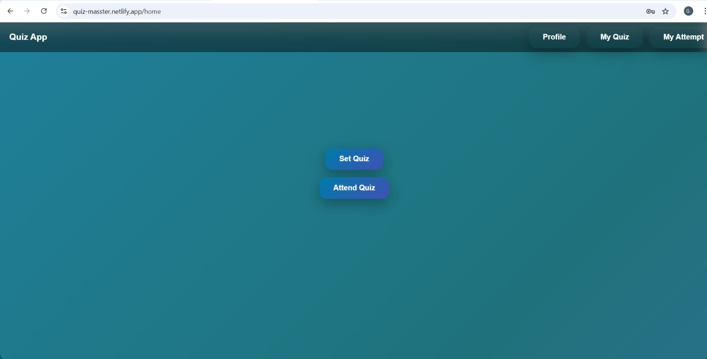
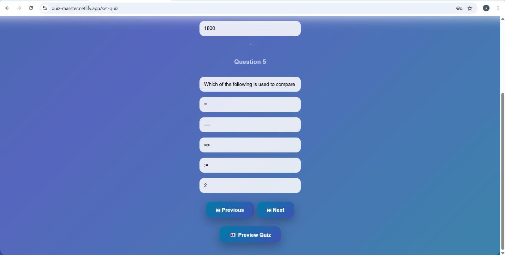
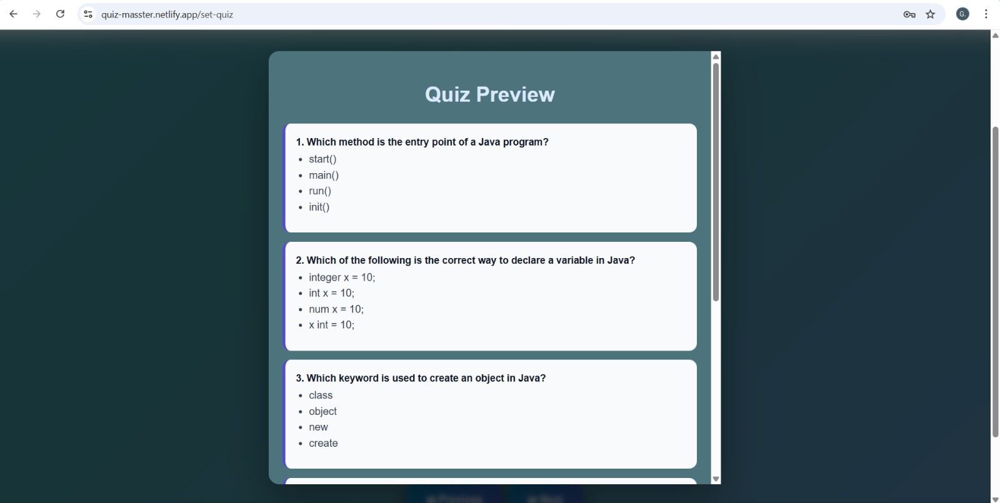
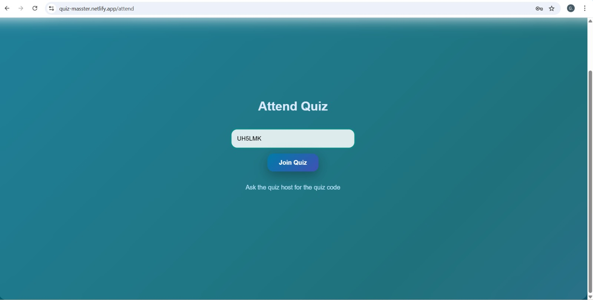
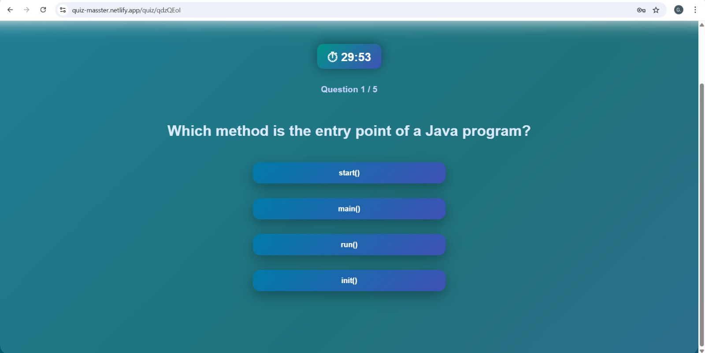
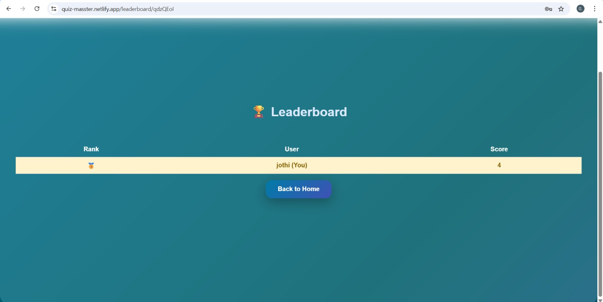

Company: Codetech IT Solutions

Intern: Gnana Jothi G   
Intern ID: CTIS0336   
Domain: Frontend Development   
Duration: 4 Weeks   
Mentor: Neela Santhosh  

# 📝 Quiz Application (React + JSON Server)

A full-featured quiz application built using **React**, **React Router**, and **JSON Server**.  
Users can create quizzes, attend quizzes using a quiz code, view results, and check leaderboards.

---

## 🚀 Features

- 🔐 User Authentication (Signup / Login)
- 🧑‍🏫 Create quizzes with multiple questions
- 🔢 Auto-generated Quiz Code
- ⏱  With Timer options
- 🧑‍🎓 Attend quiz using quiz code
- ✅ One attempt per user per quiz
- 📊 Result calculation & review
- 🏆 Leaderboard with ranking
- 🥇 Top 3 medals & current user highlight
- 📱 Responsive UI (mobile-friendly)

---

## 🛠 Tech Stack

- **Frontend:** React, React Router, Framer Motion
- **Backend:** JSON Server (Mock REST API)
- **Styling:** CSS (Glassmorphism / Modern UI)
- **State Management:** React Hooks & LocalStorage

## 👨‍💻 Author

- Gnana Jothi
- Frontend Developer | React Enthusiast

## Active Link

- [Link](https://quiz-masster.netlify.app/)

---

# Explore My Quiz Application

To get started with the app:

1️⃣ **Login or Sign Up** (for first-time users)  
2️⃣ **Choose an option:**  
   - Create a new quiz as a quiz setter  
   - Attend a quiz using a quiz code

3️⃣ **Try this sample quiz code** to explore: `HEMOJN`

The app supports:  
- Quiz creation with multiple questions  
- Timed attempts (per-question or total quiz timer)  
- Instant results after submission  
- Leaderboard to track top performers
  

